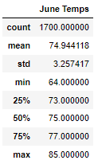
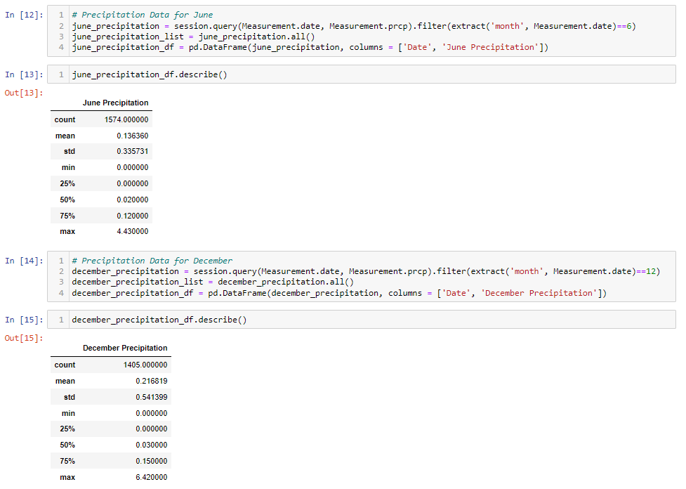

# Surf's Up 

## Overview the Analysis

We are assiting W.Avy to conduct a temperature and precipitation analysis in the months of June and December in Oahu, in order to determine if the surf and ice cream shop business is sustainable.

## Results

The analysis shows that:
- There are 1,700 observations in June and 1,517 observations in December for the entire data set in relation to Temperature
- The average temperature in June is slightly higher vs. December (74.9 degrees vs. 71.0 degrees)
- The standard deviation of June is lower vs. December (3.26 vs. 3.75), which means that data is more spread in December and there may presence of outliers in the December observations

Below you will find outputs of the summary statistics produced in the jupyter notebook:

## Summary

Based on the temperature analysis only, both June and December seem to be good months to open the ice cream shop because the average temperature is stable at around 73 degrees. Ig this trend remains in the remaining months, its reasonable to open during all the year.

However, only analyzing temperature is insufficient, we also need to analyze precipitation level which affects both the ice cream and surf shop businesses. Below you will find two additional queries that give us more prespective on the weather data, specifically precipitaion.

Based on the above, it seems that December has a higher level of precipitation (avg. of 0.22 vs. avg. of 0.14 in June). This may reduce the consumption of ice cream and not have such a big impact on the surf shop, W.Avy has to be aware of this in order to conduct the company's financial and operating planning.

